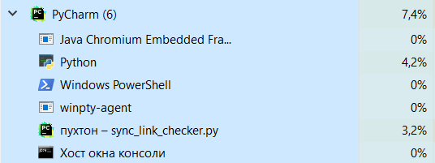

# multi
IO-bound
1) синхронная проверка ссылок на 1 потоке: 1564963ms
2) синхронная проверка ссылок с 5 воркерами: 237014ms
3) c 10:  124689ms
4) с 100:  25079ms

CPU-bound:
1. генерация монетки на 1 потоке:  75519ms
2. на 5 воркерах